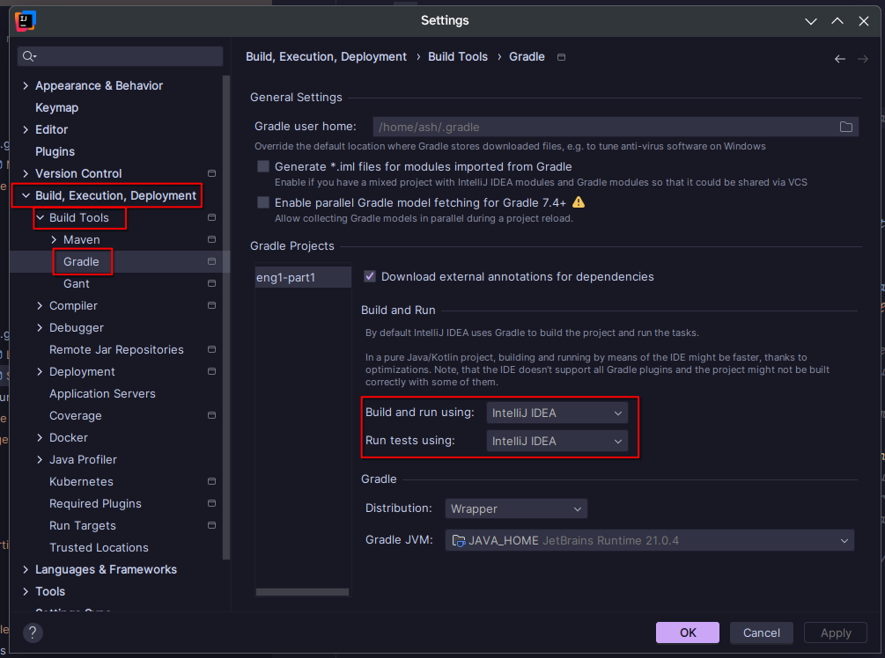

# eng1-part1

## Development

To get started with development, install [IntelliJ IDEA](https://www.jetbrains.com/idea/) (it's free!!).

Once IntelliJ is installed, open the project directory. If you have not already downloaded it (e.g. using GitHub Desktop), you can use the welcome screen to clone the GitHub repo directly by selecting "Get from VCS" and then logging in with your GitHub account.

Once the project has opened, you will need to wait until IntelliJ finishes importing the project and downloading dependencies. Depending on your computer this may take a few minutes.

After the project has imported, go to File > Settings, then change the following settings to "IntelliJ IDEA":

You should then be able to run the game by selecting "Run game" in the top-right, and then pressing play.

### Useful things

If assets (especially registry objects) are failing to load, make sure you have run the `generateAssetList` Gradle task (this should automatically be run when running the game in IntelliJ)

To build a release of the game, run the `clean ``build` task in Gradle (eg. `./gradlew clean build` on the command line), and the output JAR file will be in `lwjgl3/build/libs/`.

You can also automatically generate a list of libraries and their licenses using the `downloadLicenses` Gradle task, which will create a report in `lwjgl3/build/reports/license`.
